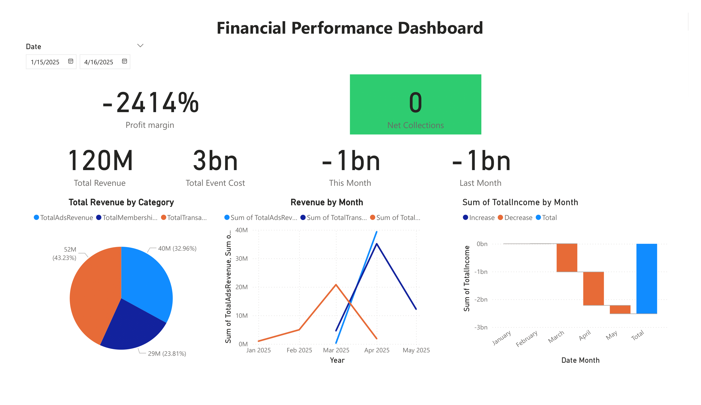
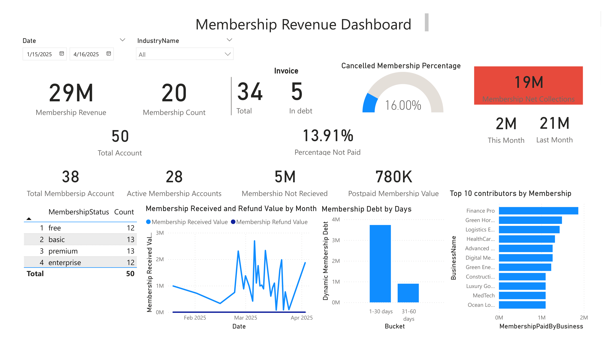
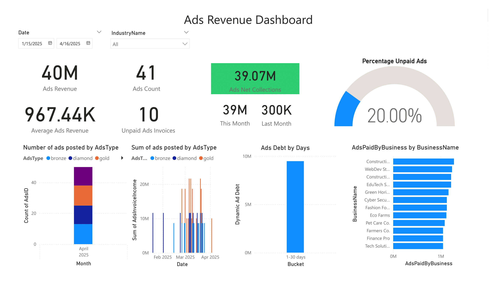
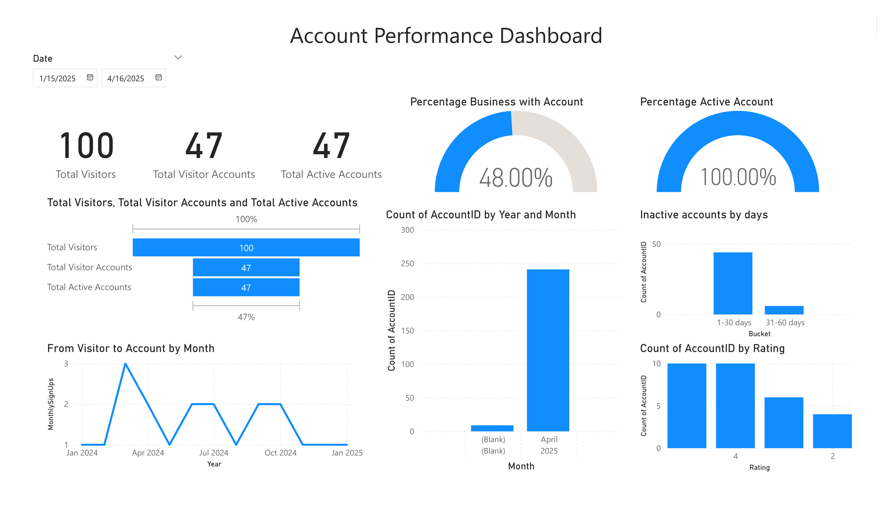

# DDDM_9mb

This project was developed during my internship at MeU Solutions to support data-driven decision-making for the business networking platform 9mb.vn.

## 🌐 About 9mb.vn
9mb.vn is a digital platform built by MeU Solutions and operated by Doanh Nhân Sài Gòn, aimed at facilitating business connections, trade promotions, and partnership discovery. Businesses can register to promote their products, search for partners, and participate in trade events.

## 🎯 Project Purpose
The main goal of this project is to:

Centralize and organize platform data into a structured database.

Build dashboards that enable stakeholders to track platform performance, user behavior, and business engagement.

Lay the foundation for data-driven decisions to improve platform efficiency and user satisfaction.

## 🔨 What I Did
During the project, I:

Designed a comprehensive relational database schema covering associations, users, businesses, sessions, ads, memberships, transactions, and more.

Imported demo data (March–May 2025) into an SQL database.

Built interactive dashboards in Power BI to visualize metrics such as user activity, ad performance, membership statistics, and error tracking.

Suggested future expansion for dashboard features and data collection.

Here are some dashboards made in PowerBI:

## 📈 Tools & Technologies
SSMS for database design and querying

Power BI for dashboarding

📄 License
This project was created during an internship at MeU Solutions and is intended for MeU use in the future.
